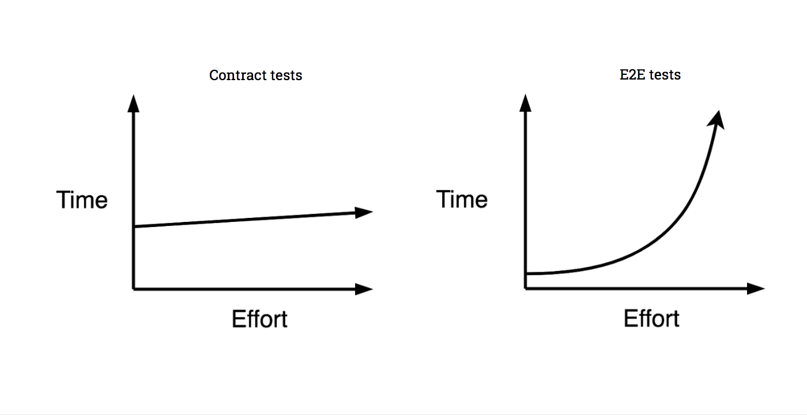
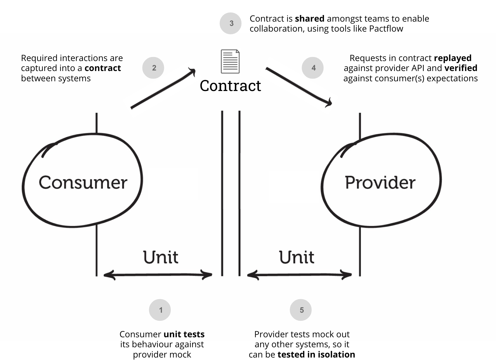

# Contract Testing

## Theory

### What is it?

A technique to ensure that the communication between two services is done correctly. Usually these services are not
developed by the same team and deployed separately. In order for the system to work correctly, the two teams must talk
to each other and agree on the messages that will be exchanged. This is a very common scenario in microservices
architectures. Automating this process is called contract testing. It is preferable to do this kind of automation as
close to the actual code as possible.

The communication of the services is done by sending messages to each other in different formats. A message is a piece
of data that is sent from one service to another. It can be a request or a response. The message layout (interface)
defines the "contract" between these two services. The contract is a set of rules that the message must follow in order
for the communication to be successful.

> Note: a service is a piece of software that is deployed separately and can be used by other services. It can be a REST API, a Pub/Sub message bus, a database, a file system, etc.

> Note: the two services can be two backend services or a backend service and a frontend service.


### Why do we need it?

#### Testing Pyramid

While developing a system, it is very common to have multiple teams working on different parts of the system. To ensure
that the system works correctly, it must be tested. The testing can be done in different ways and at different levels of
complexity.


The testing pyramid is a concept that describes the different types of tests that can be done. The tests are divided
into three categories: unit tests, integration tests, and end-to-end tests.

At the bottom of the pyramid are the unit tests. They are the simplest tests and are usually done by the developers.
They are fast and easy to write. These test the system in isolation.

The next level is the integration (service) tests. They are a bit more complex because they test the system in a more
realistic scenario like the communication with a real database or an external service. The test are usually done by
running the application in a test environment and sending requests to it. The tests are slower than the unit tests
because they require resources to be allocated and are not in-memory like the unit tests.

The last level is the end-to-end tests. They are the most complex tests because they test the entire system in a real
scenarios. All the parts of the system must be up and running in order for the tests to be successful. These tests are
the slowest because they require the most resources to be allocated.



#### Contract Testing in the Testing Pyramid

The contract testing fits between the integration tests and the unit testing in the testing pyramid. They test the
communication between two services in a somewhat realistic scenario, but run in-memory like the unit tests. The contract
tests are fast and easy to write. They are also very useful because they ensure that the communication between the
services is done correctly.

Disadvantages of integration tests for communication of services:

- They are slow because multiple services must be up and running.
- They are hard to write because they require a lot of setup.
- They are subject to flakiness due to connectivity issues.
- Don't scale well because as the number of services grows
- Communication bugs are found late in the development cycle.

Advantages of contract testing for communication of services:

- Can be done code-first, at unit test level
- They are fast because they run in-memory.
- They are easy to write because they don't require a lot of setup.
- Communication bugs are found early in the development cycle.
- They scale well because they are independent of the number of services.

### How to do it?



Contract testing is done by creating a "file" that describes the contract between the two services. This file is then
shared between the two services. It is translated in code and used in tests. Contract testing is done using different
libraries and frameworks that automate this process.

#### Consumers and Providers

The communication between two services has two parts. The first part is the consumer. The consumer is a service that
requires data from another place. It sends a request waits for a response.

The second part is the provider. The provider is a service that provides data to another service. It receives a request
and sends the response.

In order to ensure that the consumer receives the correct data and in the correct format from the provider, both
services must agree on the contract. With the contract in place, both services can be developed independently and tested
separately. The contract file must be shared between the two services. The testing frameworks will use the contract to
simulate the communication between the two services.

#### Types of contract testing

Consumer Driven Contracts the first tests are written in the consumer service the provider ensures that it provides at
least the requirements asked by the consumer. The contract file is created and updated by the consumer and shared with
the provider. The consumer asks for the data it needs and the provider provides it. The provider can send more data than
request, but the minimum requirements must be met.

Provider Driven Contracts used usually by standalone (external) services can be started from OpenAPI specifications. The
contract file is created and updated by the provider and shared with the consumer.

#### Example of contract testing frameworks

- [Pact](https://docs.pact.io/)
- [Spring Cloud Contract](https://cloud.spring.io/spring-cloud-contract/)
- [WireMock](http://wiremock.org/)

## Pact

Pact is a contract testing framework that is used to test the communication between two services. It manages the
contract file and uses it to simulate the communication between the two services. Pact implements the consumer-driven
contract testing approach.

### Pact file

The pact file is a JSON file that describes the contract. It is created by the consumer. The name of the file is
`<consumer name>-<provider name>.json`. It stores every interaction of the contract. An interaction is a request and a
response combined with other information present in the communication. For example, a request can be successful and the
data will be returned, or the request can fail and an error will be returned.

Depending on how the system is designed, the pact file can be shared in different ways. It can be saved as a file and
copied from the consumer to the provider. Another option is to use the pact broker to manage and share the pact files
more easily between different teams. For more information about the pact broker, see
this [link](https://docs.pact.io/pact_broker).

Each interaction is in fact a way to describe the actual communication. It works usually by given some concrete examples
like "string1" or 123, but the actual values are not important. The important part is the structure of the message, the
type and names of the field that compose the message.

----

The following section will present contract testing using Pact on a simple example. There are two services: the
consumer (Customer Service) and the provider (Product Service). The consumer service requires some products in order to
transform them in different ways. Both services are created using Spring Boot. For more information about Spring Boot
see this [section](README_SPRING.md).

For simplicity, the code of both applications will be presented in same project. The pact file will be shared by
creating the file in a dedicated location. In this example, we will store the pact files in a folder called `pacts`. The
consumer will generate the files in this folder and the provider will need to be setup to read the files from there.


> Note: we will be using pact version V3 for pact file specification

### Consumer

The consumer in this example is the Customer Application. All the code of the Customer Application is in the `consumer`
folder. The Customer Application will get all the products, get one product by id, and create a new product.

#### Project Setup

The consumer project is structured as follows:

```
consumer
    ├── contracts
    ├── exceptions
    ├── services
    └── MainCustomersConsumer.java
```

`MainCustomersConsumer.java` is the main class of the application. It is used to start consumer the application.

The `contracts` folder contains the classes that form the contract of the consumer with the provider.

The `services` folder contains two classes that are used to fetch and process the products. `ProductsService` is
responsible with the processing of products fetched by `ProductsFetcher`. Our attention will be focused on
the `ProductsFetcher`. `ProductsFetcher` is class that offers the methods to handle products : `getAllProducts`
, `getProduct`, `createProduct`. It uses the `RestTemplate` class to send requests to the provider.

The integration point is the `ProductsFetcher` because it is the one that makes the requests, so for it the consumer
pact tests are needed.

#### Pact Setup

In order to tell Pact where to store the pact files, we put the following lines in pom.xml:

```xml
<pact.rootDir>${project.basedir}/pacts</pact.rootDir>
```

Complete code:

```xml
<build>
    <plugins>
        <plugin>
            <groupId>org.apache.maven.plugins</groupId>
            <artifactId>maven-surefire-plugin</artifactId>
            <version>2.22.1</version>
            <configuration>
                <useSystemClassLoader>false</useSystemClassLoader>
                <systemPropertyVariables>
                    <pact.rootDir>${project.basedir}/pacts</pact.rootDir>
                    <buildDirectory>${project.build.directory}</buildDirectory>
                </systemPropertyVariables>
            </configuration>
        </plugin>
    </plugins>
</build>
```

Next step is to add the dependency for Pact for JUnit 5:

```xml
<dependency>
    <groupId>au.com.dius.pact.consumer</groupId>
    <artifactId>junit5</artifactId>
    <version>4.3.16</version>
</dependency>
```

#### Consumer Contract Test

Next step is to write the test for the consumer. The test will be written in the `ProductsFetcherTest` class, located in
the `consumer.pact` test folder. The first step is setting up the pact extension for JUnit 5. As said before, in
contract testing there are two entities, the consumer and the provider. The consumer must specify the provider name it
fetches the data from. We will be using pact version V3 for pact file specification. With the following lines, we
connect the consumer with the provider:

```java 
@ExtendWith(PactConsumerTestExt.class)
@PactTestFor(providerName = "Products Application", pactVersion = PactSpecVersion.V3)
public class ProductsFetcherPactTests {
}
```

Next is to prepare the mock server. The mock server is used to simulate the provider. In this step we will create
a `RestTemplate` and connect it to the mock server. In order to make the tests independent, we will create a new
instance of the `ProductsFetcher` before every test.

```java
@ExtendWith(PactConsumerTestExt.class)
@PactTestFor(providerName = "Products Application", pactVersion = PactSpecVersion.V3)
public class ProductsFetcherPactTests {

    private ProductsFetcher productsFetcher;

    @BeforeEach
    void setUp(MockServer mockServer) {
        RestTemplate restTemplate = new RestTemplateBuilder()
                .rootUri(mockServer.getUrl())
                .build();
        productsFetcher = new ProductsFetcher(restTemplate);
    }
}
```

The next step is to create the actual interaction between the consumer and the provider. An interaction is what the
consumer expects to happen when it makes a request, but written in a formal way. To create an interaction, we use the
annotation `@Pact` and we specify the interaction in the method body. The interaction is created using
the `PactDslWithProvider`. We create a method that describes the contract of that particular interaction.

For example, when the consumer wants to fetch a single product, it will make a `GET` request at the
address `/api/products/1` and it expects that the provider will return single product that has the following layout: a
field called `id` of type UUID, a field called `name` of type String, a field called `description` of type String and a
field called `price` of type double. The interaction will look like this:

```java
@Pact(consumer = "Customer Application")
public RequestResponsePact createProduct(PactDslWithProvider builder) {
    return builder
        .given("one create product")
        .uponReceiving("a request to create a product")
        .path("/api/products/01234567-0123-0123-0123-0123456789ab")
        .method("PUT")
        .body(new PactDslJsonBody()
            .stringType("name","Product 1")
            .stringType("description","Product 1 description")
            .numberType("price",1.0)
            .getBody()
            .toString())
        .willRespondWith()
        .status(200)
        .body(new PactDslJsonBody()
            .uuid("id",UUID.fromString("01234567-0123-0123-0123-0123456789ab"))
            .stringType("name","Product 1")
            .stringType("description","Product 1 description")
            .numberType("price",1.0))
        .toPact();
}
```

> Note: for the body we can convert the `PactDslJsonBody` to a string using the `getBody().toString()` method or we can
> use it directly in the `body` method.

Let's analyze the interaction in more detail. The `PactDslWithProvider builder` parameter is used to create the
interaction. With it, we create the interaction in a fluent manner.

`.given("one create product")` defines a so-called 'state'. Each state must have a unique name for a given path. The
state is used to define the logic that the provider will need to implement on its side. More about states will be
discussed in the provider section.

`.uponReceiving("a request to create a product")` defines the description of the interaction. It is used to describe
what the intent of the interaction is about. It doesn't serve any special purpose, but it helps in organizing the
interactions. We usually group interactions by the action and make multiple states. For
example, `a request to create a product` may have multiple states, one success state and one failure state.

`.path("/api/products/01234567-0123-0123-0123-0123456789ab")` defines the path of the request. The actual path that the
consumer wants is `/api/products/{id}`. The `{id}` is a path variable. The path variable is replaced with the value
`01234567-0123-0123-0123-0123456789ab` when the request is actually made. We just give the value as an example, but the
important thing is the structure of the address the request is made at: `/api/products`, followed by the id of the
product we want more information about.

`.method("PUT")` defines the method of the request. In this case, it is a `PUT` request.

`.body(new PactDslJsonBody()` defines the body of the request. This refers to the layout of the message that the
consumer sends to the provider and based on that, it will act accordingly. To simplify the process of defining the body,
pact offers some classes that help with the definition of messages. In this case, we use the `PactDslJsonBody` class.

`.willRespondWith()` marks the end of the request definition and the beginning of the response definition. What is
before this line, is the consumer part of the contract. What follows this line is the provider part of the contract. In
other words, what is before this line is the job of the consumer to set the message correctly and what follows this line
is the job of the provider to set the values correctly.

`.status(200)` defines the status code of the response. In this case, it is `200` which means that the request was Ok.

`.body(new PactDslJsonBody())` defines the body of the response. This is where the provider must set the values
correctly, because the consumer uses this body to continue its processing.

The last line, `.toPact()` is used to build the interaction and mark to the Pact framework that it can be used in the
pact file generation process.

#### DSL for defining messages

Pact offers a DSL (Domain Specific Language) for defining messages. The DSL is used to define the layout of the message,
in other words the type and name of the fields that the message contains. The DSL is used to define the body of the
request or the response message. We will use two classes for defining the body of the message: `PactDslJsonBody`
and  `PactDslJsonArray`. The first one is used to define the body of the message as a JSON object and the second one is
used to define the body of the message as a JSON array.

Let's look at some examples of how to use the `PactDslJsonBody` class. The following code snippets show how to define
the message structure and how it will look like in the pact file.

Example 1:

```java
new PactDslJsonBody()
        .stringType("name","Product 1")
        .stringType("description","Product 1 description")
        .numberType("price",1.0);
```

```json
{
  "name": "Product 1",
  "description": "Product 1 description",
  "price": 1.0
}
```

Example 2:

```java
new PactDslJsonBody()
        .eachLike("products")
        .numberType("id",1)
```

```json
{
  "products": [
    {
      "id": 1
    }
  ]
}
```

Example 3:

```java
new PactDslJsonBody()
        .booleanType("success",true)
        .array("values")
        .stringValue("value 1")
```

```json
{
  "success": true,
  "values": [
    "value 1"
  ]
}
```

Example 4:

```java
new PactDslJsonBody()
        .uuid("id",UUID.fromString("01234567-0123-0123-0123-0123456789ab"))
```

```json
{
  "id": "01234567-0123-0123-0123-0123456789ab"
}
```

The Pact framework will interpret the json above as follows: the message contains a field called `name` of type String,
a field called `description` of type String and a field called `price` of type double. The values of the fields are
given more like an example for the developers, but the important thing is the structure of the message.

Let's look at some examples of how to use the `PactDslJsonArray` class. The following code snippets show how to define
the message structure and how it will look like in the pact file.

Example 1:

```java
new PactDslJsonArray()
        .stringType("Product 1")
```

```json
[
  "Product 1"
]
```

Example 2:

```java
new PactDslJsonArray()
        .object()
        .stringType("name","Product 1")
        .closeObject()
```

```json
[
  {
    "name": "Product 1"
  }
]
```

Example 3:

```java
new PactDslJsonArray()
        .array()
        .object()
        .stringValue("name","Name1")
        .closeObject()
        .closeArray();
```

```json
[
  [
    {
      "name": "Name1"
    }
  ]
]
```

Example 4:

```java
new PactDslJsonArray()
        .object()
        .numberType("id",1)
        .array("products")
        .object()
        .stringType("name","Product 1")
        .closeObject()
        .closeArray()
        .closeObject()
```

```json
[
  {
    "id": 1,
    "products": [
      {
        "name": "Product 1"
      }
    ]
  }
]
```

#### Testing the consumer

After we defined the contract with the `@Pact` annotation, we can test the consumer. The test consists in calling the
method of the `productsFetcher` that we have written the interaction for. We annotate the test method with the
`@PactTestFor` annotation and we pass the name of the method that described the interaction.

```java
@Test
@PactTestFor(pactMethod = "createProduct")
void testCreateProduct() {
   productsFetcher.createProduct("Product 1", "Product 1 description", 1.0);
}
```

We can take a step further and test that the `productsFetcher` receives uses the correct values. We can do this by taken
advantage of the example values we have set in the method annotated with `@Pact`. We make the request as previously, but
we assert that the values of the fields are the ones we have set as examples.

```java
@Test
@PactTestFor(pactMethod = "createProduct")
void testCreateProduct() {
    ProductResponse productResponse = productsFetcher.createProduct("Product 1", "Product 1 description", 1.0);

    assertEquals(UUID.fromString("01234567-0123-0123-0123-0123456789ab"), productResponse.getId());
    assertEquals("Product 1", productResponse.getName());
    assertEquals("Product 1 description", productResponse.getDescription());
    assertEquals(1.0, productResponse.getPrice());
}
```

### Provider

The provider in this example is the Products Application. All the code of the Products Application is in the `provider`
folder.

#### Project Setup

```
provider
    ├── contracts
    ├── controllers
    ├── services
    └── MainProductsProvider.java
```

`MainProductsProvider.java` is the main class of the application. It is used to start the provider application.

The `contracts` folder contains the classes that form the contract of the provider with the consumer.

The `controllers` folder contains the classes that define the endpoints of the provider. More information about the
controllers can be found [here](README_SPRING.md#controllers). The controllers use the services to implement the logic
and to correlate the requests to the responses. We only have one controller in this example, the `ProductsController`.

The `services` folder contains the classes that implement the logic of the provider. We will use the `ProductsService`
interface to define the operations that the controller will use to implement the logic. The `ProductsServiceImpl` class
is given as an example of the actual implementation of the service.

The integration point is the `ProductsController` because it is the one that handles the requests, so for it will be
added contract tests.

#### Pact Setup

The dependency for Pact for JUnit 5:

```xml
<dependency>
    <groupId>au.com.dius.pact.provider</groupId>
    <artifactId>junit5</artifactId>
    <version>4.3.16</version>
</dependency>
```

#### Provider Contract Test

Next step is to write the test for the consumer. The test will be written in the `ProductsFetcherTest` class, located in
the `provider.pact` test folder.

The first step is setting up the pact extension for JUnit 5. We will tell the pact framework where to look for pact
files with the `@PactFolder` annotation. We need to set the folder to be the same one that the consumer writes the pact
files to.

Next, we will set the name of the provider with the `@Provider` annotation. The string given to the annotation parameter
must match the name of the provider that was given when we created the consumer tests.

In order to simplify our tests, we will create the provider tests as 'Spring Boot Tests'. This means, that our provider
application will run as if it was started from the command line. We will use the `@SpringBootTest` annotation to tell
JUnit that the test will be a Spring Boot Test.

Because we don't want to use the actual implementation of the `ProductsService` interface, we will create a mock for it
using the `@MockBean` annotation. When the controller is created, it will use our mock class instead of the actual one.

```java
@PactFolder("pacts")
@Provider("Products Application")
@SpringBootTest(classes = MainProductsProvider.class, webEnvironment = SpringBootTest.WebEnvironment.RANDOM_PORT)
public class ProductsControllerPactTests {
    @MockBean
    private ProductsService productsService;
}
```

> We set the port of the provider application to be random, so that we don't have to worry about port conflicts.

The next step is to set up the pact framework to verify our contracts. The framework will benefit from the fact that our
application is running and will make requests to the endpoints of the provider as described in the pact files. To ensure
that the requests are in compliance with the pact files, use the `PactVerificationContext` to verify the interaction.

One thing to note is that in order for the pact framework to make the requests correctly, we must specify the port of
our application.

```java
@PactFolder("pacts")
@Provider("Products Application")
@SpringBootTest(classes = MainProductsProvider.class, webEnvironment = SpringBootTest.WebEnvironment.RANDOM_PORT)
public class ProductsControllerPactTests {
    @LocalServerPort
    private int serverPort;

    @BeforeEach
    void setupTestTarget(PactVerificationContext context) {
        context.setTarget(new HttpTestTarget("localhost", serverPort));
    }

    @TestTemplate
    @ExtendWith(PactVerificationInvocationContextProvider.class)
    void pactVerificationTestTemplate(PactVerificationContext context) {
        context.verifyInteraction();
    }
}
```

#### States

If we run the tests now, they will fail because the provider application is not ready to handle the requests.

We will see 4 failing tests, because the consumer expects 4 different interactions with the provider.


As described above, for each interaction we define a so-called state. Each state must be unique for a given path and
corresponds to a case in which the provider application is in a certain state. For example, when the consumer makes a
request to get a specific product by id, that particular id might not exist. In that case, we simulate the behavior of
that specific case in the test, by mocking the service function with the value that it should return when the id does
not exist.

To implement a state, we will use the `@State` annotation with the value of the state as the parameter of the
annotation.

Let's take a look at the controller to see how the `productService` is used, so that we know how to mock it.

```java
@PostMapping()
public ProviderProductResponse createProduct(@RequestBody CreateProduct createProduct) {
    return productsService.createProduct(createProduct);
}
```

As you can see, the controller passes the request to the service and returns the value that it returns. We will mock the
service to return a specific value when the `createProduct` function is called. We don't care about the value of the
input parameter, so we put `any()` as the parameter of the `when` function. The mocked result doesn't matter either, so
we will use `thenReturn` to return a dummy value. The important thing is that the values aren't the ones that matter,
but the fact that `ProviderProductResponse` has fields with the name and type that the consumer expects.

```java
@State("one create product")
void oneCreateProduct() {
    ProviderProductResponse product=new ProviderProductResponse(UUID.randomUUID(),"Product 1","Product 1 description",11,"store 1",1);
    
    when(productsService.createProduct(any())).thenReturn(product);
}
```

> Note that in the provider tests we only mock the result. The assertions are done automatically by Pact based on the contract pact file

```java
public class ProviderProductResponse {
    private UUID id; // this is important
    private String name;  // this is important
    private String description;  // this is important
    private double price;  // this is important
    private String storeName; // this is not relevant for this particular contract
    private int storeId; // this is not relevant for this particular contract
}
```

> Note that the `ProviderProductResponse` has more fields than the contract asked by the consumer.
> This is ok as long the asked fields are present in the final payload.

Let's take a look at the case when the interaction between the consumer and the provider results in a not found error.

```java
@GetMapping("{id}")
public ResponseEntity<ProviderProductResponse> getProduct(@PathVariable UUID id) {
    return productsService.getProduct(id)
        .map(ResponseEntity::ok)
        .orElse(ResponseEntity.notFound().build());
}
```

As you can see, when `productsService.getProduct` returns an empty `Optional`, the controller returns a `404` status. In
that state, we will mock the service to return an empty `Optional`. When the endpoint is called by the pact framework,
in that given state, the controller will use the mock function to return the `404` status it expects in the contract.

```java
@State("one product does not exist")
void oneProductDoesNotExist() {
    when(productsService.getProduct(any())).thenReturn(Optional.empty());
}
```

> The important takeaway from this is that for each interaction, we must define a state that will simulate the behavior of
> the provider application in that particular case. The state must be unique for a given path and must be defined in the pact file.

## Resources

- https://martinfowler.com/articles/practical-test-pyramid.html#ContractTests
- https://pactflow.io/blog/what-is-contract-testing/
- https://docs.pact.io/
- https://www.qentelli.com/thought-leadership/insights/what-contract-testing-and-why-should-you-try-it
- https://martinfowler.com/articles/microservice-testing/
