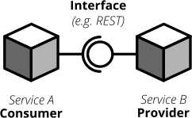
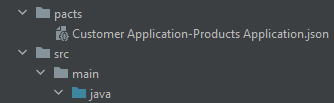

# Contract Testing

## Teorie

### Ce este?

O tehnica prin care se asigura ca comunicarea dintre doua servicii se face corect. De obicei aceste servicii nu sunt
dezvoltate de aceeasi echipa si sunt deployate separat. Pentru ca sistemul sa functioneze corect, cele doua echipe
trebuie sa comunice intre ele si sa se intelege pe mesajele care vor fi schimbate. Acesta este un scenariu foarte comun
in arhitecturile cu microservicii. Automatizarea acestui proces se numeste contract testing. Este preferabil sa se faca
acest fel de automatizare cat mai aproape de codul propriu-zis.

Comunicarea dintre servicii se face prin trimiterea de mesaje intre ele in diferite formate. Un mesaj este o bucata de
informatie care este trimisa de la un serviciu la altul. Poate fi o cerere sau o raspuns. Layout-ul mesajului
(interfata) defineste "contractul" dintre cele doua servicii. Contractul este un set de reguli care trebuie sa fie
urmate de mesaj pentru ca comunicarea sa fie reusita.

> Observatie: un serviciu este o bucata de software care este deployata separat si poate fi folosita de alte servicii. Poate fi un REST API, un Pub/Sub message bus, o baza de date, un sistem de fisiere, etc.

> Observatie: cele doua servicii pot fi doua servicii backend sau un serviciu backend si un serviciu frontend.



### De ce aveam nevoie de contract testing?

#### Piramida de testare

Cand dezvoltam un sistem, este foarte comun sa avem mai multe echipe care lucreaza la diferite parti ale sistemului.
Pentru a asigura ca sistemul functioneaza corect, acesta trebuie testat. Testele pot fi facute in diferite moduri si la
diferite nivele de complexitate.


Piramida de testare este un concept care descrie diferitele tipuri de teste care pot fi facute. Testele sunt impartite
in trei categorii: teste unitare, teste de integrare si teste end-to-end.

La baza piramidei sunt testele unitare. Sunt cele mai simple teste si sunt de obicei facute de dezvoltatori. Sunt rapide
si usor de scris. Aceste teste testeaza sistemul in izolare.

Urmatorul nivel este cel al testelor de integrare (service tests). Sunt mai complexe deoarece testeaza sistemul intr-un
scenariu mai realist precum comunicarea cu o baza de date sau un serviciu extern. Testele sunt de obicei facute prin
rularea aplicatiei intr-un mediu de testare si trimiterea de cereri catre ea. Testele sunt mai lente decat cele unitare
deoarece au nevoie de resurse alocate si nu sunt in memorie precum cele unitare.

Ultimul nivel este cel al testelor end-to-end. Sunt cele mai complexe deoarei testeaza intregul sistem intr-un scenariu
real. Toate partiile sistemului trebuie sa fie pornite pentru ca testele sa fie reusite. Aceste teste sunt cele mai
lente deoarece au nevoie de cele mai multe resurse alocate.


#### Contract Testing in piramida de testare

Contract testing se incadreaza intre testele de integrare si cele unitare in piramida de testare. Testele contract
testeaza comunicarea dintre doua servicii intr-un scenariu mai realist, dar ruleaza in memorie precum cele unitare.
Testele contract sunt rapide si usor de scris. Sunt de asemenea foarte utile deoarece asigura ca comunicarea dintre
servicii se face corect.

Dezavantaje teste de integrare pentru testarea comunicarii dintre servicii:

- Sunt lente deoarece mai multe servicii trebuie sa fie pornite.
- Sunt greu de scris deoarece necesita multe configurari.
- Sunt supuse erorilor deoarece pot aparea probleme de conectivitate.
- Nu se pot scala bine deoarece numarul de servicii creste.
- Erorile de comunicare sunt descoperite tarziu in ciclul de dezvoltare.

Avantaje contract testing pentru testarea comunicarii dintre servicii:

- Pot fi facute code-first, la nivel de test unitare
- Sunt rapide deoarece ruleaza in memorie.
- Sunt usor de scris deoarece nu necesita multe configurari.
- Erorile de comunicare sunt descoperite devreme in ciclul de dezvoltare.
- Se pot scala bine deoarece sunt independente de numarul de servicii.

### Cum putem face contract testing?


Contract testing se face prin crearea unui "fisier" care descrie contractul dintre cele doua servicii. Acest fisier este
apoi impartit intre cele doua servicii. Este tradus in cod si folosit in teste. Contract testing se face folosind
diferite biblioteci si framework-uri care automatizeaza acest proces.

#### (Consumatori si Producatori) Consumers and Providers

Comunicarea dintre doua servicii are doua parti. Prima parte este consumatorul. Consumatorul este un serviciu care are
nevoie de date de la alt loc. Trimite o cerere si asteapta un raspuns.

A doua parte este producatorul. Producatorul este un serviciu care furnizeaza date altui serviciu. Primeste o cerere si
trimite un raspuns.

Pentru a asigura ca consumatorul primeste datele corecte si in formatul corect de la producator, cele doua servicii
trebuie sa fie de acord asupra contractului. Cu contractul in loc, cele doua servicii pot fi dezvoltate independent si
testate separat. Fisierul contractului trebuie impartit intre cele doua servicii. Framework-urile de testare vor folosi
contractul pentru a simula comunicarea dintre cele doua servicii.

#### Tipuri de contract testing

Contracte dirijate de consumator (Consumer Driven Contracts) sunt testele in care primele teste sunt scrise in serviciul
consumator. Producatorul asigura ca furnizeaza cel putin cerintele cerute de consumator. Fisierul contractului este
creat si actualizat de consumator si impartit cu producatorul. Consumatorul cere datele pe care le are nevoie si
producatorul le furnizeaza. Producatorul poate trimite mai multe date decat cererea, dar cerintele minime trebuie sa fie
indeplinite.

Contracte dirijate de producator (Provider Driven Contracts) sunt testele in care primele teste sunt scrise in serviciul
producator. Sunt folosite de obicei de servicii independente (externe). Contractul este creat si actualizat de
producator si impartit cu consumatorul.

#### Exemple de framework-uri de contract testing

- [Pact](https://docs.pact.io/)
- [Spring Cloud Contract](https://cloud.spring.io/spring-cloud-contract/)
- [WireMock](http://wiremock.org/)

## Pact

Pact este un framework de testare contract care este folosit pentru a testa comunicarea dintre doua servicii.
Gestioneaza fisierul contractului si il foloseste pentru a simula comunicarea dintre cele doua servicii. Pact
implementeaza contract testing dirijat de consumator (consumer driven contract).

### Pact file

Fisierul contractului este un fisier JSON care descrie contractul. Este creat de consumator. Numele fisierului este
`<nume consumator>-<nume producator>.json`. Acesta stocheaza fiecare interacțiune a contractului. O interacțiune este o
cerere si un raspuns combinat cu alte informatii prezente in comunicare. De exemplu, o cerere poate fi reusita si datele
vor fi returnate, sau cererea poate esua si o eroare va fi returnata.

In functie de arhitetura sistemului, fisierul contractului poate fi impartit in mai multe moduri. Poate fi salvat ca un
fisier si copiat de la consumator la producator. O alta optiune este sa folosim Pact Broker pentru a gestiona si partaja
mai usor fisierele contractului intre echipe diferite. Pentru mai multe informatii despre Pact Broker,
vedeti [link](https://docs.pact.io/pact_broker).

Fiecare interacțiune este de fapt o modalitate de a descrie comunicarea. De obicei functioneaza prin furnizarea unor
exemple concrete precum "string1" sau 123, dar valorile reale nu sunt importante. Partea importanta este structura
mesajului, tipul si numele campurilor care compun mesajul.

----

Urmatoarea sectiune va prezenta contract testing folosind Pact pe un exemplu simplu. Sunt doua servicii: consumatorul
(Customer Service) si producatorul (Product Service). Serviciul consumator are nevoie de produse pentru a le transforma
in diferite moduri. Cele doua servicii sunt create folosind Spring Boot. Pentru mai multe informatii despre Spring Boot
vedeti [sectiunea  aceasta](README_SPRING_RO.md).

Pentru simplificare, codul celor doua aplicatii va fi prezentat in acelasi proiect. Fisierul contractului va fi impartit
prin crearea fisierului intr-o locatie dedicata. In acest exemplu, vom stoca fisierele contractului intr-o folder
numita `pacts`. Consumatorul va genera fisierele in aceasta folder si producatorul va trebui sa fie configurat pentru a
citii fisierele din acolo.



> Observatie: vom folosi versiunea V3 pentru specificarea fisierului contractului

### Consumatorul (Consumer)

Consumatorul in acest exemplu este Customer Application. Tot codul aplicatiei Customer este in folderul `consumer`.
Acesta va obtine toate produsele, va obtine un produs dupa id si va crea un produs nou.

#### Structura proiectului

Structura proiectului este urmatoarea:

```
consumer
    ├── contracts
    ├── exceptions
    ├── services
    └── MainCustomersConsumer.java
```

`MainCustomersConsumer.java` este clasa principala a aplicatiei. Este folosita pentru a porni aplicatia consumator.

Folderul `contracts` contine clasele care formeaza contractul consumatorului cu producatorul.

Folderul `services` contine doua clase care sunt folosite pentru a obtine si procesa produsele. `ProductsService` este
responsabil cu procesarea produselor obtinute de `ProductsFetcher`. Atentia noastra va fi concentrata pe
`ProductsFetcher`. `ProductsFetcher` este clasa care ofera metodele pentru a gestiona produsele: `getAllProducts`,
`getProduct`, `createProduct`. Foloseste clasa `RestTemplate` pentru a trimite cereri producatorului.

Punctul de integrare este `ProductsFetcher` pentru ca este clasa care trimite cereri, asa ca pentru aceasta avem nevoie
de teste contract consumator.

#### Configurare Pact

Pentru a specifica unde sa stocheze Pact fisierele contractului, vom adauga urmatoarele linii in pom.xml:

```xml
<pact.rootDir>${project.basedir}/pacts</pact.rootDir>
```

Codul complet:

```xml
<build>
    <plugins>
        <plugin>
            <groupId>org.apache.maven.plugins</groupId>
            <artifactId>maven-surefire-plugin</artifactId>
            <version>2.22.1</version>
            <configuration>
                <useSystemClassLoader>false</useSystemClassLoader>
                <systemPropertyVariables>
                    <pact.rootDir>${project.basedir}/pacts</pact.rootDir>
                    <buildDirectory>${project.build.directory}</buildDirectory>
                </systemPropertyVariables>
            </configuration>
        </plugin>
    </plugins>
</build>
```

Urmatorul pas este sa adaugam dependinta pentru Pact pentru JUnit 5:

```xml
<dependency>
    <groupId>au.com.dius.pact.consumer</groupId>
    <artifactId>junit5</artifactId>
    <version>4.3.16</version>
</dependency>
```

#### Testele de contract pentru consumator

Urmatul pas este sa scriem testele pentru consumator. Testele vor fi scrise in clasa `ProductsFetcherTest`, localizata
in folderul `consumer.pact`. Primul pas este sa setam extensia Pact pentru JUnit 5. Cum am spus mai sus, in contract
testing exista doua entitati, consumatorul si producatorul. Consumatorul trebuie sa specifice numele producatorului de
la care obtine datele. Vom folosi versiunea V3 pentru specificarea fisierului contractului. Cu urmatoarele linii, ne
conectam consumatorul cu producatorul:

```java 
@ExtendWith(PactConsumerTestExt.class)
@PactTestFor(providerName = "Products Application", pactVersion = PactSpecVersion.V3)
public class ProductsFetcherPactTests {
}
```

In continuare vom pregati serverul mock. Serverul mock este folosit pentru a simula producatorul. In acest pas vom crea
un `RestTemplate` si il vom conecta la serverul mock. Pentru a face testele independente, vom crea o noua instanta a
`ProductsFetcher` inainte de fiecare test.

```java
@ExtendWith(PactConsumerTestExt.class)
@PactTestFor(providerName = "Products Application", pactVersion = PactSpecVersion.V3)
public class ProductsFetcherPactTests {

    private ProductsFetcher productsFetcher;

    @BeforeEach
    void setUp(MockServer mockServer) {
        RestTemplate restTemplate = new RestTemplateBuilder()
                .rootUri(mockServer.getUrl())
                .build();
        productsFetcher = new ProductsFetcher(restTemplate);
    }
}
```

Urmatorul pas este sa cream interacțiunea dintre consumator si producator. O interacțiune este ceea ce consumatorul
asteapta sa se intample cand trimite o cerere, dar scris in mod formal. Pentru a crea o interacțiune, vom folosi
anotarea `@Pact` si vom specifica interacțiunea in corpul metodei. Interacțiunea este creata
folosind `PactDslWithProvider`. Vom crea o metoda care descrie contractul acestei interacțiuni particulare.

De exemplu, cand consumatorul vrea sa obtina un singur produs, va trimite o cerere `GET` la adresa `/api/products/1`
si asteapta ca producatorul sa returneze un singur produs care are urmatoarea structura: un camp `id` de tip UUID, un
camp `name` de tip String, un camp `description` de tip String si un camp `price` de tip double. Interactiunea va arata
astfel:

```java
@Pact(consumer = "Customer Application")
public RequestResponsePact createProduct(PactDslWithProvider builder) {
    return builder
        .given("one create product")
        .uponReceiving("a request to create a product")
        .path("/api/products/01234567-0123-0123-0123-0123456789ab")
        .method("PUT")
        .body(new PactDslJsonBody()
            .stringType("name","Product 1")
            .stringType("description","Product 1 description")
            .numberType("price",1.0)
            .getBody()
            .toString())
        .willRespondWith()
        .status(200)
        .body(new PactDslJsonBody()
            .uuid("id",UUID.fromString("01234567-0123-0123-0123-0123456789ab"))
            .stringType("name","Product 1")
            .stringType("description","Product 1 description")
            .numberType("price",1.0))
        .toPact();
}
```

> Observatie: pentru corpul cererii, putem converti `PactDslJsonBody` in string folosind metoda `getBody().toString()`
> sau il putem folosi direct metoda `body`.

Sa analizam interacțiunea mai in detaliu. Parametrul `PactDslWithProvider builder` este folosit pentru a crea
interacțiunea. Cu el, vom crea interacțiunea in mod fluent.

`.given("one create product")` defineste un 'state'. Fiecare state trebuie sa aiba un nume unic pentru o anumita cale.
State-ul este folosit pentru a defini logica pe care producatorul trebuie sa o implementeze de partea sa. Mai multe
despre state-uri vor fi discutate in sectiunea producatorului.

`.uponReceiving("a request to create a product")` defineste descrierea interacțiunii. Este folosit pentru a descrie ce
este intentia interacțiunii. Nu are nici un rol special, dar ajuta la organizarea interacțiunilor. De obicei, grupam
interacțiunile dupa actiune si facem mai multe state-uri. De exemplu, `a request to create a product` poate avea mai
multe state-uri, un state de succes si un state de esec.

`.path("/api/products/01234567-0123-0123-0123-0123456789ab")` defineste calea cererii. Calea reala pe care consumatorul
o doreste este `/api/products/{id}`. `{id}` este o variabila de cale. Variabila de cale este inlocuita cu valoarea
`01234567-0123-0123-0123-0123456789ab` cand cererea este facuta. Doar dam o valoare ca exemplu, dar importantul este
structura adresei la care se face cererea: `/api/products`, urmata de id-ul produsului pe care vrem sa obtinem mai multe
informatii despre el.

`.method("PUT")` defineste metoda cererii. In acest caz, este o cerere `PUT`.

`.body(new PactDslJsonBody()` defineste corpul cererii. Acesta se refera la structura mesajului pe care consumatorul il
trimite producatorului si pe baza acesteia, va actiona corespunzator. Pentru a simplifica procesul de definire a
corpului, pact ofera anumite clase care ajuta la definirea mesajelor. In acest caz, vom folosi clasa `PactDslJsonBody`.

`.willRespondWith()` marcheaza sfarsitul definitiei cererii si inceputul definitiei raspunsului. Ce este inainte de
aceasta linie, este partea consumatorului a contractului. Ce urmeaza aceasta linie este partea producatorului a
contractului. In alte cuvinte, ce este inainte de aceasta linie este sarcina consumatorului de a seta mesajul corect si
ce urmeaza aceasta linie este sarcina producatorului de a seta valorile corect.

`.status(200)` defineste codul de stare al raspunsului. In acest caz, este `200` care inseamna ca cererea a fost Ok.

`.body(new PactDslJsonBody()` defineste corpul raspunsului. Acesta este locul unde producatorul trebuie sa seteze
valorile corecte, deoarece consumatorul foloseste acest corp pentru a continua procesarea.

Ultima linie, `.toPact()` este folosita pentru a crea interacțiunea si pentru a marca framework-ului Pact ca poate fi
folosit in procesul de generare a fisierului pact.

#### DSL pentru definirea contractului

Pact ofera un DSL (Domain Specific Language) pentru definirea mesajelor. DSL-ul este folosit pentru a defini structura
mesajului, in alte cuvinte, tipul si numele campurilor care contin mesajul. DSL-ul este folosit pentru a defini corpul
cererii sau a raspunsului. Vom folosi doua clase pentru a defini corpul mesajului: `PactDslJsonBody` si
`PactDslJsonArray`. Prima este folosita pentru a defini corpul mesajului ca un obiect JSON si a doua este folosita
pentru a defini corpul mesajului ca un array JSON.

Sa vedem cateva exemple de cum putem folosi clasa `PactDslJsonBody`. Urmatoarele fragmente de cod arata cum putem defini
structura mesajului si cum arata in fisierul pact.

Exemplu 1:

```java
new PactDslJsonBody()
        .stringType("name","Product 1")
        .stringType("description","Product 1 description")
        .numberType("price",1.0);
```

```json
{
  "name": "Product 1",
  "description": "Product 1 description",
  "price": 1.0
}
```

Exemplu 2:

```java
new PactDslJsonBody()
        .eachLike("products")
        .numberType("id",1)
```

```json
{
  "products": [
    {
      "id": 1
    }
  ]
}
```

Exemplu 3:

```java
new PactDslJsonBody()
        .booleanType("success",true)
        .array("values")
        .stringValue("value 1")
```

```json
{
  "success": true,
  "values": [
    "value 1"
  ]
}
```

Exemplu 4:

```java
new PactDslJsonBody()
        .uuid("id",UUID.fromString("01234567-0123-0123-0123-0123456789ab"))
```

```json
{
  "id": "01234567-0123-0123-0123-0123456789ab"
}
```

Framework-ul Pact va interpreta JSON-ul de mai sus astfel: mesajul contine un camp numit `name` de tip String, un camp
numit `description` de tip String si un camp numit `price` de tip double. Valorile campurilor sunt date mai degraba ca
un exemplu pentru dezvoltatori, dar importantul este structura mesajului.

Sa vedem cateva exemple de cum putem folosi clasa `PactDslJsonArray`. Urmatoarele fragmente de cod arata cum putem
defini structura mesajului si cum arata in fisierul pact.

Exemplu 1:

```java
new PactDslJsonArray()
        .stringType("Product 1")
```

```json
[
  "Product 1"
]
```

Exemplu 2:

```java
new PactDslJsonArray()
        .object()
        .stringType("name","Product 1")
        .closeObject()
```

```json
[
  {
    "name": "Product 1"
  }
]
```

Exemplu 3:

```java
new PactDslJsonArray()
        .array()
        .object()
        .stringValue("name","Name1")
        .closeObject()
        .closeArray();
```

```json
[
  [
    {
      "name": "Name1"
    }
  ]
]
```

Exemplu 4:

```java
new PactDslJsonArray()
        .object()
        .numberType("id",1)
        .array("products")
        .object()
        .stringType("name","Product 1")
        .closeObject()
        .closeArray()
        .closeObject()
```

```json
[
  {
    "id": 1,
    "products": [
      {
        "name": "Product 1"
      }
    ]
  }
]
```

#### Testarea consumatorului

Dupa ce am definit contractul cu anotatia `@Pact`, putem testa consumatorul. Testul consta in apelarea metodei
`productsFetcher` pe care am scris-o pentru a descrie interacțiunea. Anotam metoda de test cu anotatia
`@PactTestFor` si ii dam ca parametru numele metodei care descrie interacțiunea.

```java
@Test
@PactTestFor(pactMethod = "createProduct")
void testCreateProduct() {
   productsFetcher.createProduct("Product 1", "Product 1 description", 1.0);
}
```

Putem merge mai departe si sa testam ca `productsFetcher` foloseste valorile corecte. Putem face acest lucru folosind
valorile de exemplu pe care le-am setat in metoda anotata cu `@Pact`. Facem cererea ca in exemplul anterior, dar
verificam ca valorile campurilor sunt cele pe care le-am setat ca exemple.

```java
@Test
@PactTestFor(pactMethod = "createProduct")
void testCreateProduct() {
    ProductResponse productResponse = productsFetcher.createProduct("Product 1", "Product 1 description", 1.0);

    assertEquals(UUID.fromString("01234567-0123-0123-0123-0123456789ab"), productResponse.getId());
    assertEquals("Product 1", productResponse.getName());
    assertEquals("Product 1 description", productResponse.getDescription());
    assertEquals(1.0, productResponse.getPrice());
}
```

### Producatorul (Provider)

Producatorul in acest exemplu este Products Application. Tot codul aplicatiei Products este in folderul `provider`.

#### Structura proiectului

```
provider
    ├── contracts
    ├── controllers
    ├── services
    └── MainProductsProvider.java
```

`MainProductsProvider.java` este clasa principala a aplicatiei. Este folosita pentru a porni aplicatia.

Folderul `contracts` contine clasele care formeaza contractul dintre producator si consumator.

Folderul `controllers` contine clasele care definesc endpoint-urile producatorului. Mai multe informatii despre
controllere pot fi gasite [aici](README_SPRING_RO.md#controllers). Controllerele folosesc serviciile pentru a implementa
logica si pentru a corela cererile cu raspunsurile. In acest exemplu avem un singur controller, `ProductsController`.

Folderul `services` contine clasele care implementeaza logica producatorului. Vom folosi interfata `ProductsService`
pentru a defini operatiile pe care le va folosi controller-ul pentru a implementa logica. Clasa `ProductsServiceImpl`
este data ca exemplu de implementare a serviciului.

Punctul de integrare este `ProductsController` pentru ca este cel care gestioneaza cererile, asa ca pentru el vom adauga
teste de contract.

#### Configurare Pact

Dependindency pentru Pact pentru JUnit 5:

```xml
<dependency>
    <groupId>au.com.dius.pact.provider</groupId>
    <artifactId>junit5</artifactId>
    <version>4.3.16</version>
</dependency>
```

#### Teste contract pentru producator

Urmeaza sa scriem testul pentru consumator. Testul va fi scris in clasa `ProductsFetcherTest`, localizata in folderul
`provider.pact` al proiectului.

Primul pas este sa setam extensia pentru JUnit 5. Vom spune framework-ului Pact unde sa caute fisierele de contract cu
anotatia `@PactFolder`. Trebuie sa setam folderul sa fie acelasi cu cel in care consumatorul scrie fisierele de
contract.

In continuare vom seta numele producatorului cu anotatia `@Provider`. String-ul dat ca parametru trebuie sa corespunda
cu numele producatorului dat cand am creat teste pentru consumator.

Pentru a simplifica testele, vom crea teste pentru producator ca si 'Spring Boot Tests'. Acest lucru inseamna ca
aplicatia producatorului va rula ca si cum ar fi pornita din linia de comanda. Vom folosi anotatia `@SpringBootTest`
pentru a spune JUnit ca testul va fi un Spring Boot Test.

Pentru ca nu vrem sa folosim implementarea actuala a interfetei `ProductsService`, vom crea un mock pentru ea folosind
anotatia `@MockBean`. Cand controller-ul va fi creat, va folosi clasa mock in locul clasei reale.

```java
@PactFolder("pacts")
@Provider("Products Application")
@SpringBootTest(classes = MainProductsProvider.class, webEnvironment = SpringBootTest.WebEnvironment.RANDOM_PORT)
public class ProductsControllerPactTests {
    @MockBean
    private ProductsService productsService;
}
```

> Setam portul aplicatiei producatorului sa fie aleator, astfel incat sa nu avem conflicte cu alte aplicatii care ruleaza

Urmatorul pas este sa setam framework-ul Pact pentru a verifica contractele noastre. Framework-ul va beneficia de faptul
ca aplicatia noastra ruleaza si va face cereri catre endpoint-urile producatorului, asa cum sunt descrise in fisierele
de contract. Pentru a asigura ca cererile sunt in conformitate cu fisierele de contract, vom
folosi `PactVerificationContext`
pentru a verifica interacțiunea.

Un lucru de mentionat este ca pentru ca framework-ul Pact sa faca cererile corect, trebuie sa specificam portul
aplicatiei noastre.

```java
@PactFolder("pacts")
@Provider("Products Application")
@SpringBootTest(classes = MainProductsProvider.class, webEnvironment = SpringBootTest.WebEnvironment.RANDOM_PORT)
public class ProductsControllerPactTests {
    @LocalServerPort
    private int serverPort;

    @BeforeEach
    void setupTestTarget(PactVerificationContext context) {
        context.setTarget(new HttpTestTarget("localhost", serverPort));
    }

    @TestTemplate
    @ExtendWith(PactVerificationInvocationContextProvider.class)
    void pactVerificationTestTemplate(PactVerificationContext context) {
        context.verifyInteraction();
    }
}
```

#### Starile (States)

Daca am rula testele acum, acestea vor esua pentru ca aplicatia producatorului nu este pregatita sa gestioneze cererile.

Vom vedea 4 teste care esueaza, pentru ca consumatorul asteapta 4 interacțiuni diferite cu producatorul.


Cum am spus mai sus, pentru fiecare interacțiune definim un stat. Fiecare stare (state) trebuie sa fie unica pentru o
anumita cale si corespunde unui cas in care aplicatia producatorului este intr-un anumit stat. De exemplu, cand
consumatorul face o cerere pentru a obține un anumit produs după id, acel id anume poate nu exista. In acest caz, vom
simula comportamentul acelui caz specific in test, prin mock-uirea functiei serviciului cu valoarea care ar trebui sa
fie returnata cand id-ul nu exista.

Pentru a implementa o stare vom folosi anotatia `@State` cu valoarea starii ca parametru al anotatiei.

Sa vedem controller-ul pentru a vedea cum este folosit `productService`, astfel incat sa stim cum sa-l mock-uim.

```java
@PostMapping()
public ProviderProductResponse createProduct(@RequestBody CreateProduct createProduct) {
    return productsService.createProduct(createProduct);
}
```

Dupa cum se poate vedea, controller-ul trimite cererea la serviciu si returneaza valoarea pe care o returneaza. Vom
mock-ui serviciul pentru a returna o valoare specifica cand functia `createProduct` este apelata. Nu ne intereseaza
valoarea parametrului de intrare, asa ca vom pune `any()` ca parametru al functiei `when`. Rezultatul mock-uit nu ne
intereseaza, asa ca vom folosi `thenReturn` pentru a returna o valoare dummy. Lucrul important este ca valorile nu
conteaza, ci faptul ca `ProviderProductResponse` are campuri cu numele si tipul pe care consumatorul le asteapta.

```java
@State("one create product")
void oneCreateProduct() {
    ProviderProductResponse product=new ProviderProductResponse(UUID.randomUUID(),"Product 1","Product 1 description",11,"store 1",1);
    
    when(productsService.createProduct(any())).thenReturn(product);
}
```

> De observat ca in teste producatorului, doar mock-uim rezultatul. Asertarile sunt facute automat de Pact pe baza fisierului de contract

```java
public class ProviderProductResponse {
    private UUID id; // e important 
    private String name;  // e important
    private String description;  // e important
    private double price;  // e important
    private String storeName; // nu e important pentru acest contract
    private int storeId; // nu e important pentru acest contract
}
```

> De observat ca `ProviderProductResponse` are mai multe campuri decat contractul cerut de consumator.
> Acest lucru este ok atat timp cat campurile cerute sunt prezente in payload-ul final.

Sa vedem cazul cand interacțiunea dintre consumator si producator rezulta intr-o eroare de tip not found.

```java
@GetMapping("{id}")
public ResponseEntity<ProviderProductResponse> getProduct(@PathVariable UUID id) {
    return productsService.getProduct(id)
        .map(ResponseEntity::ok)
        .orElse(ResponseEntity.notFound().build());
}
```

Dupa cum se poate vedea, cand `productsService.getProduct` returneaza un `Optional` gol, controller-ul returneaza un
status `404`. In acest caz, vom mock-ui serviciul pentru a returna un `Optional` gol. Cand endpoint-ul este apelat de
framework-ul Pact, in starea data, controller-ul va folosi functia mock-uita pentru a returna statusul `404` pe care il
asteapta in contract.

```java
@State("one product does not exist")
void oneProductDoesNotExist() {
    when(productsService.getProduct(any())).thenReturn(Optional.empty());
}
```

> Ce este important de retinut este ca pentru fiecare interacțiune, trebuie sa definim un stat care va simula
> comportamentul aplicatiei producatorului in acel anumit caz. Starea (State) trebuie sa fie unica pentru o anumita cale
> si trebuie sa fie definita in fisierul de contract.

## Resurse

- https://martinfowler.com/articles/practical-test-pyramid.html#ContractTests
- https://pactflow.io/blog/what-is-contract-testing/
- https://docs.pact.io/
- https://www.qentelli.com/thought-leadership/insights/what-contract-testing-and-why-should-you-try-it
- https://martinfowler.com/articles/microservice-testing/
